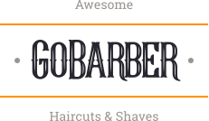
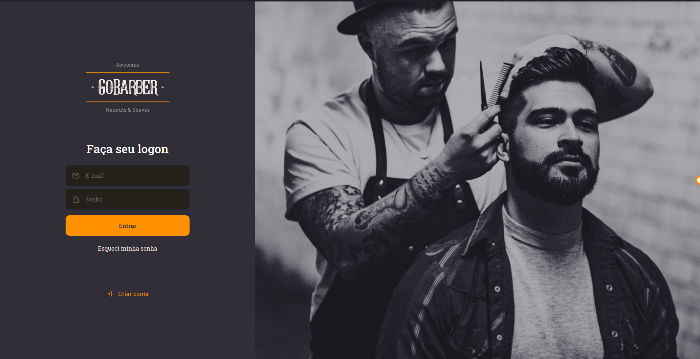
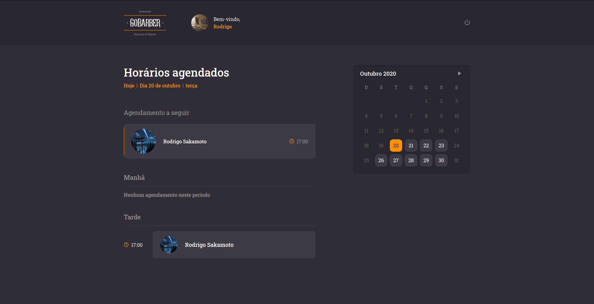

<h1 align="center">
	
</h1>

<h3 align="center">GoBarber - aplicação web para gerenciar uma barbearia fictícia desenvolvida com React.</h3>

<p align="center">
  
    
</p>

## 🛠 Tecnologias

As seguintes ferramentas foram usadas na construção do projeto:

- [React](https://pt-br.reactjs.org/)
- [TypeScript](https://www.typescriptlang.org/)
- [Styled Components](https://styled-components.com/)
- [Axios](https://github.com/axios/axios)
- [Unform](https://unform.dev/)
- [react-day-picker](https://react-day-picker.js.org/)
- [React icons](https://react-icons.github.io/react-icons/#/)
- [yup](https://github.com/jquense/yup)
- [date-fns](https://date-fns.org/)

## Pré-requisitos

Antes de começar, você vai precisar ter instalado em sua máquina as seguintes ferramentas:
[Git](https://git-scm.com), [Node.js](https://nodejs.org/en/), [Yarn](https://classic.yarnpkg.com/lang/en/).
Além disto é bom ter um editor para trabalhar com o código como [VSCode](https://code.visualstudio.com/)

E instale o backend da aplicação seguindo os passos do repositório [GoBarber-api](https://github.com/rodrigosakamoto/GoBarber-api)

## 💾 Instalação

```bash
# Clone este repositório
$ git clone https://github.com/rodrigosakamoto/gobarber-web.git

# Acesse a pasta do projeto no terminal/cmd
$ cd gobarber-web

# Instale as dependências
$ yarn

# Execute a aplicação
$ yarn start
```

---
By Rodrigo Sakamoto

[](https://www.linkedin.com/in/rodrigo-sakamoto/)
[](mailto:rodosakamoto@gmail.com)
